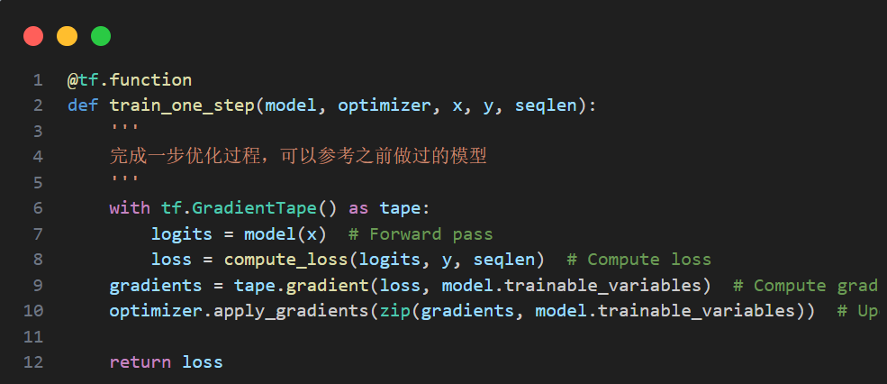
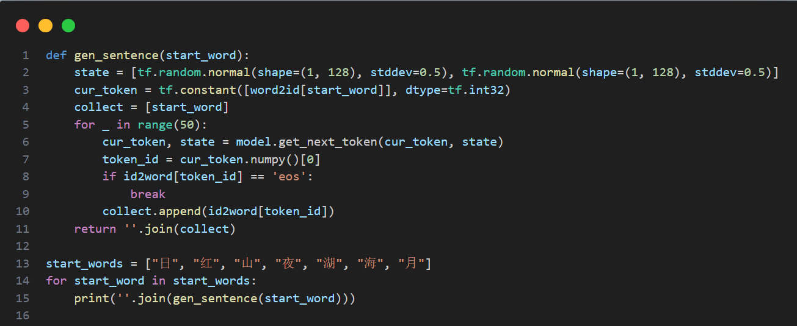
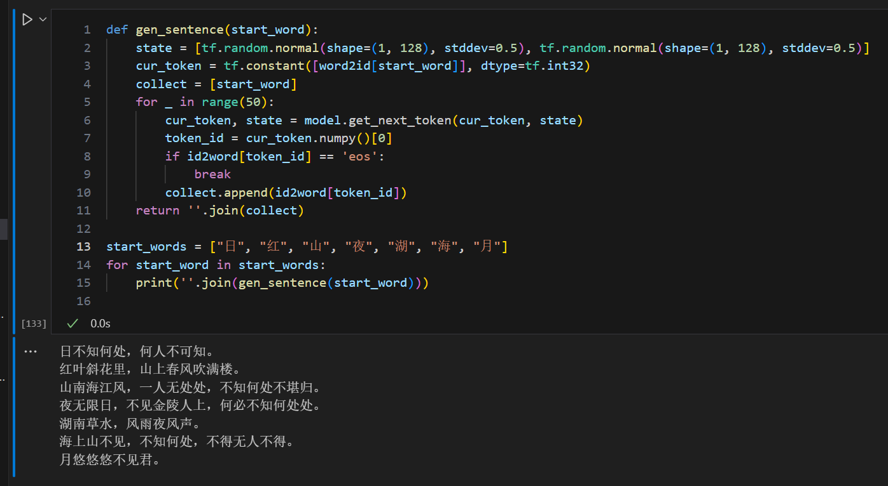
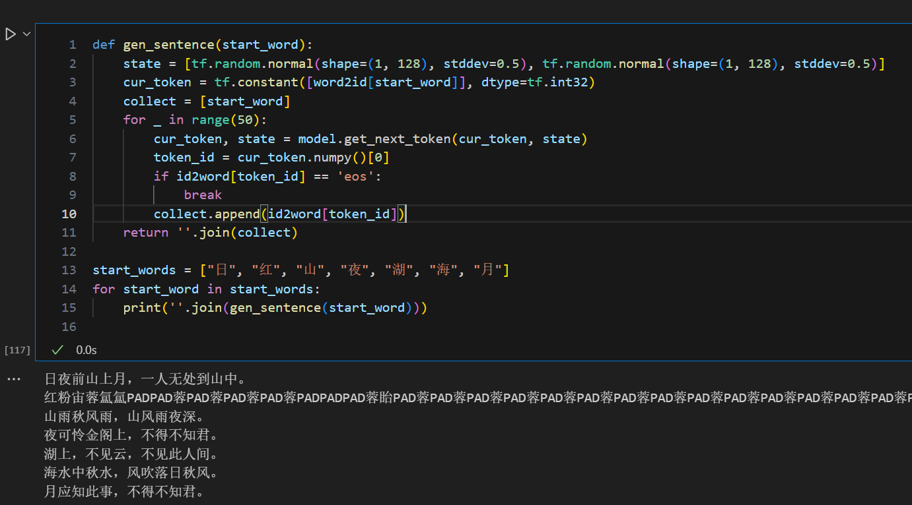

# **DL第四次作业**

2151611 谢恩赐

## 1 程序补全

## 2 模型解释

1. **循环神经网络（RNN）**：
   - RNN是一种经典的神经网络架构，专门设计用于处理序列数据。它的主要特点是在处理序列数据时具有记忆性，能够保留之前时间步的信息并将其应用于当前时间步的计算中。
   - RNN的每个时间步都会接受当前输入以及上一个时间步的隐藏状态，并生成当前时间步的输出和新的隐藏状态。这使得RNN能够捕捉到时间序列中的长期依赖关系。
   - 然而，传统的RNN存在梯度消失或梯度爆炸的问题，导致在处理长序列时性能下降。

2. **长短期记忆网络（LSTM）**：
   - LSTM是为了解决RNN的长期依赖问题而提出的一种特殊类型的RNN。
   - LSTM引入了门控机制，通过三个门（输入门、遗忘门和输出门）来控制信息的流动，从而有效地捕捉长期依赖关系。
   - LSTM的关键是细胞状态（cell state），它允许信息在时间步之间流动，而不会受到门控单元的影响。

3. **门控循环单元（GRU）**：
   - GRU是介于RNN和LSTM之间的一种门控循环神经网络结构。
   - 与LSTM类似，GRU也有门控机制，但相对于LSTM来说，GRU的结构更加简单，只有两个门（更新门和重置门）。
   - GRU的设计目的是减少参数数量，降低计算成本，并且在许多任务中表现良好。

## 3 诗歌生成

1. **数据预处理**：
   - 诗歌数据从文件中读取，并且每首诗被处理成以 "bos" (句子开始标记) 开始，以 "eos" (句子结束标记) 结束的形式。
   - 将诗歌文本转换为索引序列，以便模型能够处理。

2. **模型定义**：
   - 使用 TensorFlow 的 Keras 接口定义了一个自定义 RNN 模型 (`myRNNModel`)。
   - 模型的核心部分包括嵌入层 (`Embedding`)、RNN 层 (`SimpleRNNCell`) 和输出层 (`Dense`)。

3. **损失函数定义**：
   - 使用交叉熵损失函数来衡量模型生成的诗歌与实际诗歌之间的差异。
   - 为了处理不同长度的诗歌，采用了平均损失的方式。

4. **训练过程**：
   - 通过优化器 (这里使用了 Adam 优化器) 不断调整模型的参数，使得模型生成的诗歌逐渐接近实际诗歌。
   - 训练过程中，诗歌数据被分批次输入到模型中进行训练，每个批次的损失被计算并用于参数更新。

5. **生成诗歌**：
   - 定义了一个生成函数 (`gen_sentence`)，它以指定的词语作为开头，利用训练好的模型逐词生成诗歌的内容。
   - 生成过程通过不断预测下一个词语并更新模型的隐藏状态来实现，直到生成了 "eos" 结束标记或达到最大长度限制。

6. **输出结果**：
   - 最终，根据用户指定的开头词语，调用生成函数生成相应的诗歌内容，并输出给用户。

## 4 生成诗歌

